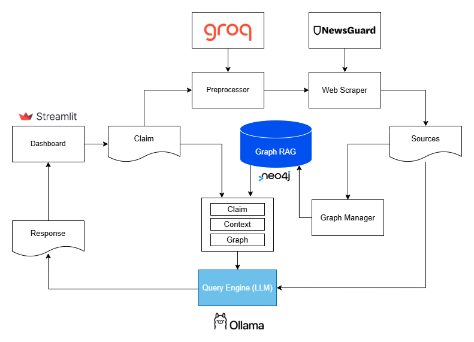

**Fact Online eXamination AI** (FOX AI) is an advanced application designed to evaluate the reliability of a news item through state-of-the-art deep fact-checking techniques, leveraging highly credible sources.

Beginning with a claim provided by the user, related news articles are retrieved and assessed based on the reliability of their sources. 

To ensure high accuracy in source selection, the system performs a dual filtering process:

1. **NewsGuard Ranking Database**: Sources are initially filtered using the NewsGuard Ranking Database to prioritize reliability.
2. **Correlation Testing**: An additional correlation test is conducted using an LLM to verify the relevance and alignment between the source and the claim to be validated. This step minimizes the risk of selecting irrelevant or misleading articles.

These articles are then processed and linked within a GraphRAG framework. The Large Language Model (LLM) generates a contextual response to the claim.

**Objectives**:

- **Truthfulness Assessment**: Determine the truthfulness of the analyzed news item based on the identified sources.
- **Transparent Explanations**: Provide clear and detailed explanations of the classification process, explicitly citing the sources used in the evaluation.
- **Knowledge Graphs**: Generate knowledge graphs from the identified sources to enhance interpretability.
- **Comprehensive Reporting**: Deliver a user-friendly, interactive report accessible via a dashboard.

### Tools and Technologies

- **Dashboard**: Built using **Streamlit** to provide an interactive and intuitive user interface.
- **Large Language Models (LLMs)**: Hosted on **Groq Cloud** and **Ollama** for advanced reasoning and validation tasks.
- **GraphRAG Framework**: Utilizes **Neo4j** for constructing and analyzing relational knowledge graphs.



---

## Prerequisites
To use this project, you need to configure the following tools:

1. **Docker Setup** *(Recommended)*
   - If using Docker, you can skip the manual installation steps below.
2. **Python Libraries** *(Manual Installation Only)*
3. **Neo4j** *(Manual Installation Only)*
4. **Ollama** *(Manual Installation Only)*
5. **NewsGuard Ranking Database** *(Recommended)*
6. **Groq Cloud**

## Option 1: Run with Docker *(Recommended)*

To simplify the setup process, you can run the application using Docker. There are two options depending on your system:

### Standard Docker Setup
For systems that do not have a GPU compatible with CUDA, use the following command to start the application:
```bash
docker compose up --build
```

### GPU-Accelerated Setup (NVIDIA GPUs Required)
If your system has an NVIDIA GPU and supports CUDA, you can use the GPU-accelerated version. Ensure that you have the **NVIDIA Container Toolkit** installed before running the following command:

- **Installation Guide:** [NVIDIA Container Toolkit Installation](https://docs.nvidia.com/datacenter/cloud-native/container-toolkit/latest/install-guide.html)

- If you are using **Docker Desktop on Windows**, the NVIDIA Container Toolkit is already included.

Once the toolkit is installed, run:
```bash
docker-compose -f docker-compose-gpu.yml build
docker-compose -f docker-compose-gpu.yml up
```

Note: Neo4j authentication is disabled in the Docker version, so you do not need to provide a username and password.

## Option 2: Manual Installation
If you prefer to install and run the application locally without Docker, follow these steps:

### Step 1: Set Up the Environment

#### 1. Create and activate a new virtual environment:
```bash
conda create --name myenv python=3.13.1
conda activate myenv
```

#### 2. Install the required Python libraries:
```bash
pip install -r requirements.txt
```

### Step 2: Neo4j Setup

#### Download Neo4j
Download the Community Edition of Neo4j Graph Database Self-Managed from the following link: [Neo4j Deployment Center](https://neo4j.com/deployment-center/).

Note: In the local version, you need to set the username and password for Neo4j. The default admin credentials are neo4j for both the username and password.

#### Configure APOC
1. Copy the `apoc-5.26.1-core.jar` file from the `labs` folder and paste it into the `plugins` folder. Rename the copied file to `apoc.jar`.
2. Edit the `neo4j.conf` file in the `conf` folder and add the following lines at the end of the file:
   ```
   # Configure the plugin directory
   server.directories.plugins=plugins

   # Enable APOC procedures
   dbms.security.procedures.unrestricted=apoc.*, algo.*

   dbms.security.procedures.allowlist=apoc.meta.data,apoc.help
   ```

#### Set Up Environment Variables
1. Add the path to the `bin` folder of Neo4j to your system's environment variables:

   - **Windows:**
     1. Open the Start menu and search for "Environment Variables".
     2. In the "System Properties" window, click on "Environment Variables".
     3. Under "System Variables", click "New" and add:
        - Value: `C:\Path\To\Bin`
   
   - **Mac:**
     1. Open the terminal.
     2. Edit the `~/.zshrc` or `~/.bash_profile` file (depending on your shell) by adding:
        ```
        export NEO4J_BIN=/path/to/bin/folder
        ```
     3. Save the file and reload the configuration by running:
        ```bash
        source ~/.zshrc
        ```

### Step 3: Ollama Setup

#### Download Ollama
1. Visit the official website: [Ollama](https://ollama.com/) and download the software for your platform.

#### Installation on Windows
Windows users need to use the Linux version of Ollama within WSL (Windows Subsystem for Linux). Follow the official instructions to set up WSL if it's not already installed.

#### Download Models from Ollama
After installation, download the desired models from the official registry using the following commands, we recommend:
```bash
ollama pull phi3.5
```

#### Add Environment Variables for Llama
- **Windows:**
  1. Follow the instructions in the "Add Environment Variables" section and the installation path of Ollama.

## Required Steps

### Step 1: NewsGuard Ranking Database *(Recommended)*
If available, request access to the NewsGuard Ranking Database API by contacting their team. Once you receive the credentials, update the configuration.  

If the dataset is accessible, set `NEWSGUARD_RANKING = true` in the `key.env` file; otherwise, set `NEWSGUARD_RANKING = false`.

### Step 2: Register on Groq Cloud
1. Register on [Groq Cloud](https://console.groq.com/).
2. After registration, generate an API key and store it securely.

### Step 3: Create the `key.env` File

In case of launching with Docker, set `DOCKER=true` and uncomment all variables under the **Docker Version** section. Otherwise, set `DOCKER=false` and uncomment the variables under the **Local Version** section.

```env
DOCKER=true

# API URL Docker Version
OLLAMA_SERVER_URL=http://ollama:11434
NEO4J_SERVER_URL=http://neo4j:7474
OLLAMA_API_URL=http://ollama:11434
NEO4J_API_URL=http://neo4j:7474
BACKEND_API_URL=http://backend:8001
CONTROLLER_API_URL=http://controller:8003
NEO4J_URI=bolt://neo4j:7687

# API URL Local Version
# OLLAMA_SERVER_URL=http://localhost:11434
# NEO4J_SERVER_URL=http://localhost:7474
# OLLAMA_API_URL=http://localhost:8000
# NEO4J_API_URL=http://localhost:8002
# BACKEND_API_URL=http://localhost:8001
# CONTROLLER_API_URL=http://localhost:8003
# NEO4J_URI=bolt://localhost:7687

# DASHBOARD CONSTANTS
LOG_FILE=app.log
AI_IMAGE_UI=Dashboard/FOX_AI.png

# NEWSGUARD VARIABLES
NEWSGUARD_RANKING = false
CLIENT_API_ID =
NG_API_KEY = 

# DATABASE VARIABLES
SQLDB_PATH=data/fact_checker.db
ASSET_PATH=assets

# GRAPHRAG VARIABLES
MODEL_LLM_NEO4J = phi3.5:latest
NEO4J_USERNAME = 'neo4j'
NEO4J_PASSWORD = 'neo4j'

# GROQ VARIABLES
GROQ_MODEL_NAME=llama-3.3-70b-versatile
GROQ_LOW_MODEL_NAME=gemma2-9b-it
GROQ_API_KEY=
```
---

## Project Overview  

The FOX AI system is designed to deliver robust fact-checking capabilities by leveraging cutting-edge AI and modular architectural principles. Following an **object-oriented programming (OOP)** paradigm, each component adheres to the **Single Responsibility Principle (SRP)**, ensuring high modularity and maintainability. The system employs a **pipeline architecture** to organize the workflow into discrete stages, improving scalability, parallelization, and error handling.  

The architecture follows a **microservices model** and consists of the following main components:  

- **Backend**: Orchestrates the pipeline, processes claims, and interacts with the persistence database for claims, sources, and responses.  
- **Dashboard**: Provides an intuitive user interface for system interaction.  
- **Controller**: Functions as an **API Gateway**, managing communication across services, ensuring security, load balancing, and request routing.  

### Key Architectural Patterns  

- **API Gateway**: Implemented by the Controller, it centralizes access to the system's microservices and manages server startup in manual mode.  
- **Pipeline Processing**: Implemented in the Backend, this design ensures modular and maintainable execution of stages like source retrieval, analysis, and response generation.  

### Supporting Components  

To enhance functionality, the system integrates dedicated external servers:  

- **Ollama Server**: Executes the Large Language Model (LLM) for analyzing news and generating responses based on retrieved sources.  
- **Neo4j Console**: Handles the graph database, modeling relationships between sources to verify credibility.  

The system leverages APIs such as **Groq Cloud** and local lightweight models for efficient computation, balancing performance with resource requirements.  

---

## Components  

### Preprocessing Components  

The Preprocessing stage refines user-provided claims and retrieved web sources to ensure they are ready for downstream processes. This phase is critical for generating structured claims and identifying key entities for constructing the **GraphRAG**.  

The preprocessing components rely on **deep learning tools**, particularly LLMs. To maintain efficiency and scalability, the system uses **Groq Cloud APIs** for computationally intensive tasks while relying on lightweight local models for simpler ones.   

1. **Summarizer**: Generates representative summaries of input text, optimized for web search or further analysis.  
2. **NER (Named Entity Recognition)**: Extracts key entities and topics from input text, forming the foundation of the GraphRAG.  

#### Preprocessing Pipeline  

The **Preprocessing Pipeline** is designed to transform user claims and retrieved web sources into structured formats suitable for fact-checking and further analysis. It operates in two key stages:  

1. **Claim Preprocessing**  
   - Transforms user-provided claims into concise, searchable titles that retain critical information (e.g., names, dates, locations).  
   - Relies on the **llama-3.3** model via **Groq Cloud APIs** for summarization, optimizing titles for effective web search queries.  
   - Utilizes a lightweight model (**gemma-2.9**) to generate English summaries for internal processes like similarity checks and content refinement.  

2. **Sources Preprocessing**  
   - Prepares retrieved web sources for integration into the **GraphRAG** framework.  
   - Uses **NER** to extract key entities and determine the main topic of each source, leveraging Groq APIs for entity recognition.  
   - Standardizes entity variations through LLM-based merging to ensure consistency (e.g., resolving "Donald Trump" and "President Trump" into a unified entity).  

This pipeline ensures all inputs and sources are accurately structured, creating a reliable foundation for claim verification workflows.

### Web Scraper Components  

The **Web Scraper** is responsible for retrieving and processing online content to verify claims. It is composed of two main modules:  

1. **NewsGuard Client**  
   - Handles authentication and interacts with the NewsGuard API to obtain credibility ratings for websites.  
   - Acquires and uses an access token to query site reliability data, filtering out less trustworthy sources to ensure accuracy in claim verification.  

2. **Scraper**  
   - Retrieves and extracts relevant web content for claim verification.  
   - Analyzes web pages to extract titles, body text, and domains, while respecting scraping restrictions (e.g., `robots.txt`).  
   - Filters sources based on their reliability and relevance to the claim.  

#### Web Scraping Pipeline 

The **Scraper** is implemented in the `Scraper` class, which uses a DuckDuckGo client and, optionally, the NewsGuard client to assess the reliability of websites.

- **Main Method: `search_and_extract`**  
   It performs web searches using the **DDGS** DuckDuckGo library and processes the results through three stages:

   1. **Initial Filtering**  
      - Filters the results with `filter_size`, based on the reliability scores of the sites provided by `ng_client.get_rating` (e.g., rank 'T' and score ≥ 70).  
      - Checks scraping permissions with `can_scrape`, analyzing the site's `robots.txt` file.

   2. **Content Extraction**  
      - Uses `extract_context` to download and analyze web pages with **BeautifulSoup**, extracting the title, body text, and domain, handling restrictions such as authentication or paywalls.

   3. **Correlation Filtering**  
      - Applies `correlation_filter`, which uses an LLM to verify the relevance of the content to the claim, determining if the source covers the same topic or provides pertinent information.

The process is structured to ensure that only reliable and relevant sources are used for claim verification.

### GraphRAG Components 

The GraphRAG management components are responsible for processing and organizing the data required to verify claims and generate explanations. The process begins with a **data ingestion** phase, during which various sources are loaded. These sources include associated entities, topics, and reference websites, which were extracted in earlier stages of the pipeline. Specifically, the **Graph Manager** component leverages the Neo4j LangChain framework to extract relationship graphs using Cypher queries.

Graph generation and storage are managed using the `py2neo` framework, which interacts with the queries used to load and update the Neo4j graph database, ensuring that the graph structure remains up to date with the latest information.

Once the data is ingested, the **Query Engine** manages the key steps of the RAG process, utilizing a language model (LLM) to handle the following stages:

- **Retrieving**: Relevant information is retrieved from the available sources based on the user's query.
- **Encoding**: The retrieved data is encoded into a format that the LLM can process effectively.
- **Generating**: A response is generated by the LLM based on the encoded data, producing a coherent and contextually relevant output.

The encoding step is performed locally using a lighter embedding model, such as `phi3.5:latest`, available through the Ollama platform. The **retriever** utilizes Neo4j alongside the embedding model to search for and retrieve relevant information that matches the user's query. For response generation, the `llama-3.3-70b-versatile` model is used, accessed via the Groq Cloud platform. At the beginning of each execution, a cleanup of the GraphDB is performed to ensure that old information does not interfere with the new context of the response.

#### RAG Pipeline

The `RAG_Pipeline` class is designed to process, organize, and verify claims using available data. It consists of three main phases:

1. **Data Ingestion**: 
   The `load_data` method loads the data into a Neo4j graph database. Using Cypher queries, it creates nodes for articles, sites, entities, and topics, and establishes relationships like `PUBLISHED_ON`, `MENTIONS`, and `HAS_TOPIC`.

2. **Graph Generation**:
   After data ingestion, the pipeline generates visual graphs using the `generate_and_save_graphs` method. These graphs depict relationships between topics, entities, and sites and are visualized using NetworkX and Matplotlib, with nodes color-coded for readability.

3. **Response Generation**:
   The `query_similarity` method retrieves relevant data using the Neo4j graph and embedding models. The data is encoded and processed by a language model to generate a coherent response. The model evaluates the claim based on the retrieved context and generates a verdict (confirm, refute, or refrain from answering) with proper citations.

The pipeline automates claim verification by combining graph databases, embeddings, and language models, enabling efficient and transparent fact-checking.

### Data Logic Components

The **Data Logic** component is crucial for the structured processing and organization of claims, sources, and responses in the system. It ensures a solid foundation for the subsequent analysis and verification processes by managing the core data interactions.

1. **Entity Management**: 
   This module defines the core entities of the system, such as **Claim** and **Answer**, which represent the primary objects of interest in the fact-checking process.

2. **Claim**: 
   This class is responsible for managing the claim’s text, concise title, and summary, as well as linking the claim to related sources.
3. **Answer**: 
   This class is used to store and organize the response generated for a claim.

The **Database** class manages the interactions with the underlying SQLite database. It ensures secure handling of data, including:
- Managing file paths
- Establishing and closing database connections
- Executing operations such as table creation, data insertion, and information retrieval.

#### SQLite Database Structure

The SQLite database is organized with a relational model comprising three main tables:

- **sources**: Stores information about reference materials (e.g., URL, title, body), linked to **claims** via `claim_ID`.
- **claims**: Records the textual claims to verify, linked to **answers** via `claim_ID`.
- **answers**: Stores generated responses, including the answer text and associated graphs, identified by `ID`.

#### Data Entities

- **Claim Class**: Manages claim-related data, generates unique UUIDs, stores claim text, title, and summary, and handles sources via `add_sources()` and `get_dict_sources()`.
- **Answer Class**: Manages responses for claims, generates unique UUIDs, and saves answer text and optional images.

#### Database Access

The **Database** class handles data persistence with functions for:
- **Initialization**: Loads and creates the necessary directories for the database.
- **Connection Management**: Uses context manager for secure database connections.
- **Query Execution**: Executes SQL queries, creates tables, and retrieves data with methods like `create_table()` and `execute_query()`.
- **Delete Conversations**: Deletes data from `claims`, `answers`, and `sources`, and removes associated images.
- **Get History**: Retrieves saved conversations, including claims, answers, and sources.

### Backend Component

The **Backend Component** is responsible for orchestrating the entire response processing pipeline, ensuring seamless integration between preprocessing, web scraping, and GraphRAG retrieval. It serves as the central coordination layer, managing the flow of data between these modules while acting as the sole access point to the SQLite database.

#### Workflow Overview
1. **Preprocessing**: The pipeline starts with preprocessing, which structures the input claim into a title and summary, optimizing it for further analysis.
2. **Web Scraping**: The system performs web scraping to gather relevant sources, which are then further preprocessed to enhance clarity and usability.
3. **GraphRAG Retrieval**: Once the sources are refined, the GraphRAG mechanism analyzes the claim against the retrieved information, utilizing structured knowledge graphs to generate a well-founded response.
4. **Data Management**: The backend ensures efficient data storage and management, maintaining a coherent and reliable history of fact-checking interactions within the SQLite database.

### Streamlit Dashboard

The **Streamlit Dashboard** provides a user-friendly interface for interacting with the system, enabling users to input claims, view responses, and access past conversations.

The dashboard offers two main modes of operation:

1. **Chat Mode**: Allows users to input a claim (up to 800 characters). The claim is sent to the backend via an API, and the response, along with relevant sources and graphs, is displayed to the user.
2. **History Mode**: Displays previous conversations retrieved from the backend, with options to filter and search by claim title.

#### Chat Input and Validation

In **Chat Mode**, users input claims, which are validated to ensure they aren't numeric-only. Invalid claims prompt an error message. The system processes valid claims and retrieves a response from the backend.

#### Sidebar Functionality

The sidebar offers several features:
- **New Conversation**: Starts a new conversation and clears the history.
- **Delete Chat History**: Deletes all past conversations.
- **Exit Dashboard**: Stops the Streamlit app.
- **Chat History**: Displays and allows filtering/searching through past conversations.

#### Retrieving Conversations

The dashboard retrieves previous conversations via a GET REST API. Users can fetch all conversations or retrieve a specific one by its ID.

#### Additional Features
- **Graphical Outputs**: Graphs are shown in a collapsible menu and can be enlarged.
- **Logging**: Logs are used to monitor and debug the application.
- **Input Validation**: Numeric-only claims are flagged as invalid.

--- 

## Testing (branch)

Testing is a critical phase in FOX AI to ensure the system's reliability, accuracy, and robustness in information verification. The system undergoes unit, integration, and system tests, simulating real user interactions, assessing performance, and handling edge cases. A methodical approach identifies potential issues, ensuring the system operates with precision and reliability.

### Unit and Integration Testing

- **Unit Testing** focuses on individual components:
  - **Graph Manager**: Verifies Neo4J graph handling.
  - **Query Engine**: Tests similarity search and interaction with the Ollama server.

- **Integration Testing** checks the interaction between **QueryEngine** and **GraphManager**, ensuring seamless data retrieval and graph generation.

### User Interface Testing

UI testing uses decision coverage with a decision tree to test all possible outcomes. **Selenium** automates the process, ensuring correct system responses under various conditions, improving the user experience.

--- 

## Authors

- [Leonardo Catello](https://github.com/Leonard2310)
- [Lorenzo Manco](https://github.com/Rasbon99)
- [Gennaro Iannicelli](https://github.com/Gennaro2806)
- [Carmine Grosso](https://github.com/httpix3l)
- [Aurora D'Ambrosio](https://github.com/AuroraD-99)

---

## Credits
We would like to express our sincere gratitude to the NewsGuard team for granting access to the NewsGuard News Reliability Rating Database. This database has been a crucial resource in enhancing the quality and reliability of the data in our Fact-Checking project. 

For more information about NewsGuard and their work, visit their official website: https://www.newsguardtech.com.

---

## License
This project is licensed under the [GNU General Public License v3.0](LICENSE). Refer to the LICENSE file for more information.