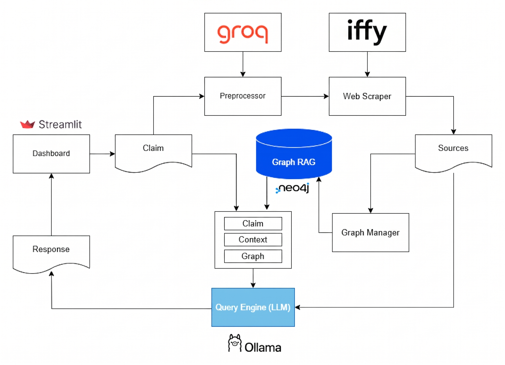

# FOX AI - Fact Online eXamination AI

**Fact Online eXamination AI** (FOX AI) is an advanced application designed to evaluate the reliability of a news item through state-of-the-art deep fact-checking techniques, leveraging highly credible sources.

Beginning with a claim provided by the user, related news articles are retrieved and assessed based on the reliability of their sources. The system performs a dual filtering process using domain credibility assessment and LLM-powered correlation testing to ensure only reliable and relevant sources are used for fact-checking.

---

## Table of Contents

- [Features & Objectives](#features--objectives)
- [Architecture Overview](#architecture-overview)
- [Quick Start](#quick-start)
- [Prerequisites](#prerequisites)
- [Installation](#installation)
- [Running the Project](#running-the-project)
- [Usage Examples](#usage-examples)
- [Evaluation Framework](#evaluation)
- [Project Structure](#project-overview)
- [Components](#components)
- [Contributing](#contributing)
- [Authors](#authors)
- [Credits & Acknowledgments](#credits--acknowledgments)
- [License](#license)

---

## Features & Objectives

FOX AI provides comprehensive fact-checking capabilities through:

- **Truthfulness Assessment**: Determine the truthfulness of analyzed news items based on identified sources.
- **Transparent Explanations**: Provide clear, detailed explanations with explicit source citations.
- **Knowledge Graphs**: Generate visual knowledge graphs from identified sources to enhance interpretability.
- **Comprehensive Reporting**: Deliver user-friendly, interactive reports via an intuitive dashboard.
- **Scientific Evaluation**: Benchmark GraphRAG architecture across two datasets in two settings:
  - **Controlled Environment**: Compared against LLM-Only, BM25 Keyword Search, and Hybrid RAG baselines
  - **Open-Web Environment**: Compared against Prompt Stuffing, BM25 Keyword Search, and Hybrid RAG baselines

---

## Architecture Overview

FOX AI follows a **microservices architecture** with an **object-oriented, pipeline-based design**:



### Core Components

- **Backend**: Orchestrates the fact-checking pipeline and manages data persistence
- **Dashboard**: Streamlit-based user interface for claim submission and result visualization
- **Controller**: API Gateway managing inter-service communication and request routing
- **Ollama Server**: Hosts local LLM and embedding models for fast inference
- **Neo4j Database**: Stores and retrieves knowledge graphs for RAG operations

### Key Technologies

- **Dashboard**: Built using **Streamlit** for intuitive user interfaces
- **Large Language Models (LLMs)**: **Groq Cloud** (for high-speed inference) and **Ollama** (for local embeddings)
- **GraphRAG Framework**: **Neo4j** for constructing and analyzing relational knowledge graphs
- **Web Scraping**: **DuckDuckGo** + **BeautifulSoup** for reliable source retrieval
- **Credibility Filtering**: **Iffy/MBFC** dataset for domain reliability assessment

---

## Quick Start

### Using Docker (Recommended - 1 minute setup)

```bash
# Clone the repository
git clone https://github.com/Rasbon99/FactCheckerAI
cd FactCheckerAI

# Run with Docker Compose
docker compose up --build

# Access the dashboard at http://localhost:8501
```

**For GPU acceleration** (NVIDIA CUDA required):
```bash
docker-compose -f docker-compose-gpu.yml up
```

### Manual Setup (Local Installation)

For detailed manual setup instructions, see [Installation](#installation) section below.

---

## Prerequisites

Before installation, ensure you have:

**Required:**
- **Python 3.13.1** (for manual installation)
- **Docker & Docker Compose** (for Docker setup - recommended)
- **Groq Cloud API Key** ([Register here](https://console.groq.com/))
- **Neo4j Desktop** (for local graph database management)

---

## Installation

### Option 1: Docker Setup *(Recommended)*

Docker provides the simplest and most reliable setup:

#### Standard Docker Setup (CPU)
```bash
cd FactCheckerAI
docker compose up --build
```
Access the dashboard at `http://localhost:8501`

#### GPU-Accelerated Setup (NVIDIA CUDA)

**Prerequisites:**
- NVIDIA GPU with CUDA support
- [NVIDIA Container Toolkit](https://docs.nvidia.com/datacenter/cloud-native/container-toolkit/latest/install-guide.html)
- Docker Desktop on Windows includes the toolkit automatically

```bash
docker-compose -f docker-compose-gpu.yml build
docker-compose -f docker-compose-gpu.yml up
```

**Note:** Neo4j authentication is disabled in Docker, so no credentials needed.

### Option 2: Manual Installation

For local development or customization, install dependencies manually:

#### Step 1: Environment Setup

**Create and activate a Conda virtual environment:**
```bash
conda create --name foxai python=3.13.1
conda activate foxai
pip install -r requirements.txt
```

#### Step 2: Neo4j Setup

**Download Neo4j:**
- Visit [Neo4j Deployment Center](https://neo4j.com/deployment-center/) and download the Community Edition
- Default credentials: `neo4j` / `neo4j`

**Install APOC Plugin (Recommended):**
1. Open your Neo4j instance
2. Go to **Plugins** section
3. Install **APOC** from the available plugins list
4. Restart the instance

**Manual APOC Setup (Alternative):**
1. Copy `apoc-5.26.1-core.jar` from labs folder to plugins folder
2. Rename to `apoc.jar`
3. Edit `neo4j.conf` and add:
   ```
   server.directories.plugins=plugins
   dbms.security.procedures.unrestricted=apoc.*, algo.*
   dbms.security.procedures.allowlist=apoc.meta.data,apoc.help
   ```

**Set Neo4j Environment Variables:**

*Mac/Linux:*
```bash
echo 'export NEO4J_BIN=/path/to/neo4j/bin' >> ~/.zshrc
source ~/.zshrc
```

*Windows:*
- Open Environment Variables
- Add new System Variable with Neo4j bin path

#### Step 3: Ollama Setup

**Download & Install:**
1. Visit [Ollama.com](https://ollama.com/) and download for your platform
2. For Windows: Use WSL (Windows Subsystem for Linux)

**Pull Required Models:**
```bash
# LLM for reasoning and response generation
ollama pull phi3.5

# Embedding model for semantic search
ollama pull nomic-embed-text
```

#### Step 4: Configure API Keys & Environment

**Register on Groq Cloud:**
1. Go to [Groq Cloud Console](https://console.groq.com/)
2. Create an account and generate an API key
3. Store it securely

**Create `key.env` Configuration File:**

In case of launching with Docker, set `DOCKER=true` and uncomment all variables under the **Docker Version** section. Otherwise, set `DOCKER=false` and uncomment the variables under the **Local Version** section.

```env
DOCKER=false

# API URL Docker Version
# OLLAMA_SERVER_URL=http://ollama:11434
# NEO4J_SERVER_URL=http://neo4j:7474
# OLLAMA_API_URL=http://ollama:11434
# NEO4J_API_URL=http://neo4j:7474
# BACKEND_API_URL=http://backend:8001
# CONTROLLER_API_URL=http://controller:8003
# NEO4J_URI=bolt://neo4j:7687

# API URL Local Version
OLLAMA_SERVER_URL=http://localhost:11434
NEO4J_SERVER_URL=http://localhost:7474
OLLAMA_API_URL=http://localhost:8000
NEO4J_API_URL=http://localhost:8002
BACKEND_API_URL=http://localhost:8001
CONTROLLER_API_URL=http://localhost:8003
NEO4J_URI=bolt://localhost:7687

# DASHBOARD CONSTANTS
LOG_FILE=app.log
AI_IMAGE_UI=assets/FOX_AI.png

# DATABASE VARIABLES
SQLDB_PATH=Outputs/fact_checker.db
GRAPHS_PATH=Outputs/graphs
ASSET_PATH=assets

# GRAPHRAG VARIABLES
MODEL_LLM_NEO4J=phi3.5:latest
NEO4J_USERNAME=
NEO4J_PASSWORD=

# GROQ VARIABLES
GROQ_MODEL_NAME=llama-3.3-70b-versatile
GROQ_LOW_MODEL_NAME=openai/gpt-oss-20b
GROQ_API_KEY=

# EXPERIMENT VARIABLES
EXPERIMENTS_EVIDENCES_PATH=Outputs/experiments_evidences
# Set this for the robustness tests to differentiate them in the tracker e.g., noisy, conflicting or missing otherwise keep it empty.
EXPERIMENT_NAME= 
EXPERIMENT_ACTIVE_DATASET=AVERITEC

# FEVER VARIABLES
FEVER_DATASET_PATH=Datasets/FEVER/fever_dev_dataset.jsonl
FEVER_WIKIPEDIA_PAGES_PATH=Datasets/FEVER/wiki-pages/wiki-pages
FEVER_WIKIPEDIA_DB_PATH=Datasets/FEVER/fever_wiki.db

# AVERITEC VARIABLES
AVERITEC_DATASET_PATH=Datasets/AVERITEC/averitec_dev_dataset.json
AVERITEC_KNOWLEDGE_STORE_PATH=Datasets/AVERITEC/dev_knowledge_store
AVERITEC_USE_METADATA=True

```

#### Step 5: Initialize Database

**Local Execution:**
```bash
python init_db.py
```

**Docker Execution:**
Automatically handled by the backend service on startup.

---

## Running the Project

FOX AI uses a **microservices architecture** and requires simultaneous execution of multiple services.

### Local Setup (5 Terminals)

**Prerequisites:**
- Complete all [Installation](#installation) steps
- Set `DOCKER=false` in `key.env`
- Ensure all prerequisite services are installed

**Open 5 separate terminals** and run these commands:

| Terminal | Service | Command | Port |
|----------|---------|---------|------|
| 1 | Ollama Server | `python start_ollama_server.py` | 8000 |
| 2 | Neo4j Database | `python start_neo4j_server.py` | 8002 |
| 3 | Controller (API Gateway) | `python start_controller_server.py` | 8003 |
| 4 | Backend Service | `python start_backend_server.py` | 8001 |
| 5 | Dashboard (Streamlit) | `streamlit run Dashboard/dashboard.py` | 8501 |

### Verification

✅ **System Check:**
1. Navigate to [http://localhost:8501](http://localhost:8501) for the Streamlit Dashboard
2. Submit a test claim to verify all services are communicating
3. Check logs in each terminal for errors

### Troubleshooting

| Issue | Solution |
|-------|----------|
| Port Already in Use | Modify port numbers in configuration files or start scripts |
| Service Connection Errors | Verify all 5 services started successfully; check logs |
| Missing Models | Run `ollama pull phi3.5 && ollama pull nomic-embed-text` |
| Database Errors | Run `python init_db.py` and verify Neo4j is running |
| Import Errors | Ensure all packages installed: `pip install -r requirements.txt` |

---

## Usage Examples

### Basic Claim Verification

1. **Access the Dashboard:** Open `http://localhost:8501`
2. **Submit a Claim:** Enter a claim (e.g., "The Earth is flat")
3. **Review Results:** See:
   - Verdict (SUPPORTS / REFUTES / NOT ENOUGH INFO)
   - Retrieved sources with reliability scores
   - Knowledge graph visualization
   - Detailed reasoning chain

### Programmatic Usage (Backend API)

```bash
# Submit a claim via HTTP
curl -X POST http://localhost:8001/run_pipeline \
  -H "Content-Type: application/json" \
  -d '{"claim": "Your claim here"}'
```

### Running Evaluation Benchmarks

See [Evaluation Framework](#evaluation) section for running scientific benchmarks.

---

## Evaluation

The evaluation code lives under the `Evaluation/` folder and is split into four parts:

- `Evaluation/Setup/` for dataset preparation and indexing
- `Evaluation/Runners/Controlled/` for the controlled-dataset experiments
- `Evaluation/Runners/OpenWeb/` for the open-web experiments
- `Evaluation/Analysis/` for post-run metrics

Each runner script defines `MAX_CLAIMS_TO_TEST` near the top of the file. The default value is small so you can do a fast sanity check, but you can increase or decrease it before running the script if you want to benchmark more or fewer claims.

All scripts under `Evaluation/` should be launched with `python -m` from the project root.

### 1. Required Dataset Layout

The evaluation scripts read the dataset locations from `key.env`, so keep the files and folders named exactly as configured there.

#### FEVER

Download the following resources from [FEVER](https://fever.ai/dataset/fever.html):

- Shared Task Development Dataset (Labelled)
- Pre-processed Wikipedia Pages (June 2017 dump)

Place them in these paths:

- `Datasets/FEVER/fever_dev_dataset.jsonl`
- `Datasets/FEVER/wiki-pages/wiki-pages/`

Then build the local SQLite database and BM25 index:

```bash
python -m Evaluation.Setup.build_fever_db
python -m Evaluation.Setup.setup_bm25_index
```

#### AVeriTeC

Download the following resources from [AVeriTeC](https://fever.ai/dataset/averitec.html):

- Development Dataset
- Evidence Collection Provided (Google Search API, Fever 7)

Place them in these paths:

- `Datasets/AVERITEC/averitec_dev_dataset.json`
- `Datasets/AVERITEC/dev_knowledge_store/`

The development dataset is loaded by array index, so the evidence files inside `dev_knowledge_store` must be named with the matching claim id, for example `0.json`, `1.json`, `2.json`, and so on.

If you extract the dataset into a different folder structure, rename or move the files so the final paths still match the values in `key.env`.

### 2. Controlled Environment Experiments

Set `EXPERIMENT_ACTIVE_DATASET` in `key.env` to either `FEVER` or `AVERITEC` before running the scripts.

The controlled experiments are:

- `Evaluation/Runners/Controlled/run_baseline_llm_only.py`
- `Evaluation/Runners/Controlled/run_baseline_bm25.py`
- `Evaluation/Runners/Controlled/run_baseline_hybrid.py`
- `Evaluation/Runners/Controlled/run_foxai.py`

Run them with module syntax from the project root:

```bash
python -m Evaluation.Runners.Controlled.run_baseline_llm_only
python -m Evaluation.Runners.Controlled.run_baseline_bm25
python -m Evaluation.Runners.Controlled.run_baseline_hybrid
python -m Evaluation.Runners.Controlled.run_foxai
```

The controlled FoxAI runner uses the local preprocessing and GraphRAG pipeline directly, so no backend HTTP call is required.

### 3. Open-Web Experiments

The open-web experiments are:

- `Evaluation/Runners/OpenWeb/run_baseline_prompt_stuffing.py`
- `Evaluation/Runners/OpenWeb/run_baseline_bm25.py`
- `Evaluation/Runners/OpenWeb/run_baseline_hybrid.py`
- `Evaluation/Runners/OpenWeb/run_foxai.py`

Run them with module syntax from the project root:

```bash
python -m Evaluation.Runners.OpenWeb.run_baseline_prompt_stuffing
python -m Evaluation.Runners.OpenWeb.run_baseline_bm25
python -m Evaluation.Runners.OpenWeb.run_baseline_hybrid
python -m Evaluation.Runners.OpenWeb.run_foxai
```

The open-web FoxAI runner sends requests to the backend endpoint defined in `key.env`, so make sure the supporting services are running first.

### 4. Evaluation Reports

After running the experiments, use the analysis scripts to summarize the results stored in the SQLite database:

```bash
python -m Evaluation.Analysis.calculate_effectiveness
python -m Evaluation.Analysis.calculate_efficiency
```

`calculate_effectiveness.py` prints the accuracy and per-label classification report, while `calculate_efficiency.py` prints the average latency, token usage, and call counts per pipeline stage.

## Project Structure

### Overview  

The FOX AI system is designed to deliver robust fact-checking capabilities by leveraging cutting-edge AI and modular architectural principles. Following an **object-oriented programming (OOP)** paradigm, each component adheres to the **Single Responsibility Principle (SRP)**, ensuring high modularity and maintainability. The system employs a **pipeline architecture** to organize the workflow into discrete stages, improving scalability, parallelization, and error handling.  

The architecture follows a **microservices model** and consists of the following main components:  

- **Backend**: Orchestrates the pipeline, processes claims, and interacts with the persistence database for claims, sources, and responses.  
- **Dashboard**: Provides an intuitive user interface for system interaction.  
- **Controller**: Functions as an **API Gateway**, managing communication across services, ensuring security, load balancing, and request routing.  

### Key Architectural Patterns  

- **API Gateway**: Implemented by the Controller, it centralizes access to the system's microservices and manages server startup in manual mode.  
- **Pipeline Processing**: Implemented in the Backend, this design ensures modular and maintainable execution of stages like source retrieval, analysis, and response generation.  

### Supporting Components  

To enhance functionality, the system integrates dedicated external servers:  

- **Ollama Server**: Executes the Large Language Model (LLM) for analyzing news and generating responses based on retrieved sources.  
- **Neo4j Console**: Handles the graph database, modeling relationships between sources to verify credibility.  

The system leverages **Groq Cloud APIs** and local lightweight models for efficient computation, balancing performance with resource requirements.  

---

## Components  

### Preprocessing Components  

The Preprocessing stage refines user-provided claims and retrieved web sources to ensure they are ready for downstream processes. This phase is critical for generating structured claims and identifying key entities for constructing the **GraphRAG**.  

The preprocessing components rely on **deep learning tools**, particularly LLMs. To maintain efficiency and scalability, the system uses **Groq Cloud APIs** for computationally intensive tasks while relying on lightweight local models for simpler ones.   

1. **Summarizer**: Generates representative summaries of input text, optimized for web search or further analysis.  
2. **NER (Named Entity Recognition)**: Extracts key entities and topics from input text, forming the foundation of the GraphRAG.  

#### Preprocessing Pipeline  

The **Preprocessing Pipeline** is designed to transform user claims and retrieved web sources into structured formats suitable for fact-checking and further analysis. It operates in two key stages:  

1. **Claim Preprocessing**  
   - Transforms user-provided claims into concise, searchable titles that retain critical information (e.g., names, dates, locations).  
   - Relies on the **llama-3.3** model via **Groq Cloud APIs** for summarization, optimizing titles for effective web search queries.  
   - Utilizes a lightweight model (**gemma-2.9**) to generate English summaries for internal processes like similarity checks and content refinement.  

2. **Sources Preprocessing**  
   - Prepares retrieved web sources for integration into the **GraphRAG** framework.  
   - Uses **NER** to extract key entities and determine the main topic of each source, leveraging Groq APIs for entity recognition.  
   - Standardizes entity variations through LLM-based merging to ensure consistency (e.g., resolving "Donald Trump" and "President Trump" into a unified entity).  

This pipeline ensures all inputs and sources are accurately structured, creating a reliable foundation for claim verification workflows.

### Web Scraper Components  

The **Web Scraper** is responsible for retrieving and processing online content to verify claims. It is composed of two main modules:  

1. **Local Iffy Dataset**
   - Uses a local Iffy/MBFC-style dataset located at Datasets/iffy_index.csv to obtain domain reliability labels.
   - The dataset is loaded and used to filter out domains marked as "Low" or "Very Low" factual reporting, ensuring less-trustworthy domains are excluded.

2. **Scraper**  
   - Retrieves and extracts relevant web content for claim verification.  
   - Analyzes web pages to extract titles, body text, and domains, while respecting scraping restrictions (e.g., `robots.txt`).  
   - Filters sources based on their reliability and relevance to the claim.  

#### Web Scraping Pipeline 

The **Scraper** is implemented in the `Scraper` class, which uses a DuckDuckGo client together with the local Iffy dataset to assess the reliability of websites.

- **Main Method: `search_and_extract`**  
   It performs web searches using the **DDGS** DuckDuckGo library and processes the results through three stages:

   1. **Initial Filtering**  
      - Filters the results with `filter_sites`, based on domain labels from the local Iffy dataset (e.g., exclude domains labeled 'Low' or 'Very Low').  
      - Checks scraping permissions with `can_scrape`, analyzing the site's `robots.txt` file.

   2. **Content Extraction**  
      - Uses `extract_context` to download and analyze web pages with **BeautifulSoup**, extracting the title, body text, and domain, handling restrictions such as authentication or paywalls.

   3. **Correlation Filtering**  
      - Applies `correlation_filter`, which uses an LLM to verify the relevance of the content to the claim, determining if the source covers the same topic or provides pertinent information.

The process is structured to ensure that only reliable and relevant sources are used for claim verification.

### GraphRAG Components 

The GraphRAG management components are responsible for processing and organizing the data required to verify claims and generate explanations. The process begins with a **data ingestion** phase, during which various sources are loaded. These sources include associated entities, topics, and reference websites, which were extracted in earlier stages of the pipeline. Specifically, the **Graph Manager** component leverages the Neo4j LangChain framework to extract relationship graphs using Cypher queries.

Graph generation and storage are managed using the `py2neo` framework, which interacts with the queries used to load and update the Neo4j graph database, ensuring that the graph structure remains up to date with the latest information.

Once the data is ingested, the **Query Engine** manages the key steps of the RAG process, utilizing a language model (LLM) to handle the following stages:

- **Retrieving**: Relevant information is retrieved from the available sources based on the user's query.
- **Encoding**: The retrieved data is encoded into a format that the LLM can process effectively.
- **Generating**: A response is generated by the LLM based on the encoded data, producing a coherent and contextually relevant output.

The encoding step is performed locally using a lighter embedding model, such as `phi3.5:latest`, available through the Ollama platform. The **retriever** utilizes Neo4j alongside the embedding model to search for and retrieve relevant information that matches the user's query. For response generation, the `llama-3.3-70b-versatile` model is used, accessed via the Groq Cloud platform. At the beginning of each execution, a cleanup of the GraphDB is performed to ensure that old information does not interfere with the new context of the response.

#### RAG Pipeline

The `RAG_Pipeline` class is designed to process, organize, and verify claims using available data. It consists of three main phases:

1. **Data Ingestion**: 
   The `load_data` method loads the data into a Neo4j graph database. Using Cypher queries, it creates nodes for articles, sites, entities, and topics, and establishes relationships like `PUBLISHED_ON`, `MENTIONS`, and `HAS_TOPIC`.

2. **Graph Generation**:
   After data ingestion, the pipeline generates visual graphs using the `generate_and_save_graphs` method. These graphs depict relationships between topics, entities, and sites and are visualized using NetworkX and Matplotlib, with nodes color-coded for readability.

3. **Response Generation**:
   The `query_similarity` method retrieves relevant data using the Neo4j graph and embedding models. The data is encoded and processed by a language model to generate a coherent response. The model evaluates the claim based on the retrieved context and generates a verdict (confirm, refute, or refrain from answering) with proper citations.

The pipeline automates claim verification by combining graph databases, embeddings, and language models, enabling efficient and transparent fact-checking.

### Data Logic Components

The **Data Logic** component is crucial for the structured processing and organization of claims, sources, and responses in the system. It ensures a solid foundation for the subsequent analysis and verification processes by managing the core data interactions.

1. **Entity Management**: 
   This module defines the core entities of the system, such as **Claim** and **Answer**, which represent the primary objects of interest in the fact-checking process.

2. **Claim**: 
   This class is responsible for managing the claim’s text, concise title, and summary, as well as linking the claim to related sources.
3. **Answer**: 
   This class is used to store and organize the response generated for a claim.

The **Database** class manages the interactions with the underlying SQLite database. It ensures secure handling of data, including:
- Managing file paths
- Establishing and closing database connections
- Executing operations such as table creation, data insertion, and information retrieval.

#### SQLite Database Structure

The SQLite database is organized with a relational model comprising three main tables:

- **sources**: Stores information about reference materials (e.g., URL, title, body), linked to **claims** via `claim_ID`.
- **claims**: Records the textual claims to verify, linked to **answers** via `claim_ID`.
- **answers**: Stores generated responses, including the answer text and associated graphs, identified by `ID`.

#### Data Entities

- **Claim Class**: Manages claim-related data, generates unique UUIDs, stores claim text, title, and summary, and handles sources via `add_sources()` and `get_dict_sources()`.
- **Answer Class**: Manages responses for claims, generates unique UUIDs, and saves answer text and optional images.

#### Database Access

The **Database** class handles data persistence with functions for:
- **Initialization**: Loads and creates the necessary directories for the database.
- **Connection Management**: Uses context manager for secure database connections.
- **Query Execution**: Executes SQL queries, creates tables, and retrieves data with methods like `create_table()` and `execute_query()`.
- **Delete Conversations**: Deletes data from `claims`, `answers`, and `sources`, and removes associated images.
- **Get History**: Retrieves saved conversations, including claims, answers, and sources.

### Backend Component

The **Backend Component** is responsible for orchestrating the entire response processing pipeline, ensuring seamless integration between preprocessing, web scraping, and GraphRAG retrieval. It serves as the central coordination layer, managing the flow of data between these modules while acting as the sole access point to the SQLite database.

#### Workflow Overview
1. **Preprocessing**: The pipeline starts with preprocessing, which structures the input claim into a title and summary, optimizing it for further analysis.
2. **Web Scraping**: The system performs web scraping to gather relevant sources, which are then further preprocessed to enhance clarity and usability.
3. **GraphRAG Retrieval**: Once the sources are refined, the GraphRAG mechanism analyzes the claim against the retrieved information, utilizing structured knowledge graphs to generate a well-founded response.
4. **Data Management**: The backend ensures efficient data storage and management, maintaining a coherent and reliable history of fact-checking interactions within the SQLite database.

### Streamlit Dashboard

The **Streamlit Dashboard** provides a user-friendly interface for interacting with the system, enabling users to input claims, view responses, and access past conversations.

The dashboard offers two main modes of operation:

1. **Chat Mode**: Allows users to input a claim (up to 800 characters). The claim is sent to the backend via an API, and the response, along with relevant sources and graphs, is displayed to the user.
2. **History Mode**: Displays previous conversations retrieved from the backend, with options to filter and search by claim title.

#### Chat Input and Validation

In **Chat Mode**, users input claims, which are validated to ensure they aren't numeric-only. Invalid claims prompt an error message. The system processes valid claims and retrieves a response from the backend.

#### Sidebar Functionality

The sidebar offers several features:
- **New Conversation**: Starts a new conversation and clears the history.
- **Delete Chat History**: Deletes all past conversations.
- **Exit Dashboard**: Stops the Streamlit app.
- **Chat History**: Displays and allows filtering/searching through past conversations.

#### Retrieving Conversations

The dashboard retrieves previous conversations via a GET REST API. Users can fetch all conversations or retrieve a specific one by its ID.

#### Additional Features
- **Graphical Outputs**: Graphs are shown in a collapsible menu and can be enlarged.
- **Logging**: Logs are used to monitor and debug the application.
- **Input Validation**: Numeric-only claims are flagged as invalid.

---

## Authors

- [Leonardo Catello](https://github.com/Leonard2310)
- [Lorenzo Manco](https://github.com/Rasbon99)
- [Gennaro Iannicelli](https://github.com/Gennaro2806)
- [Carmine Grosso](https://github.com/httpix3l)
- [Aurora D'Ambrosio](https://github.com/AuroraD-99)
- [Alireza Fazel](https://github.com/aliknot)

---

## Credits and Acknowledgments

This project was developed as an academic research initiative. We would like to extend our gratitude to our academic advisors and research peers for their guidance and ongoing support throughout the development cycle.

**Data & Fact-Checking Providers:**
The Open-Web architecture of FOX AI utilizes the open-source **Iffy.news Index**, which is powered by data rigorously curated by **Media Bias/Fact Check (MBFC)**. We thank them for their dedication to tracking domain credibility and combating web disinformation.

**Core Technologies:**
This architecture was made possible by incredible open-source and developer tools, including **Neo4j** for GraphRAG modeling, **Ollama** for local embeddings, **Groq Cloud** for rapid LLM inference, and **Streamlit** for the frontend dashboard.

---

## License
This project is licensed under the [GNU General Public License v3.0](LICENSE). Refer to the LICENSE file for more information.